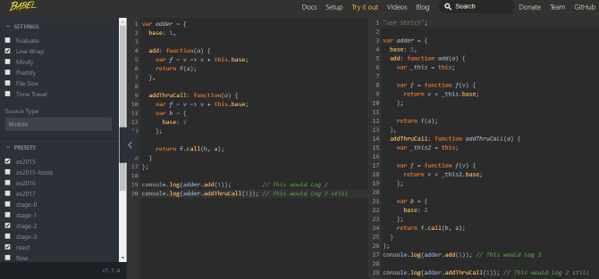
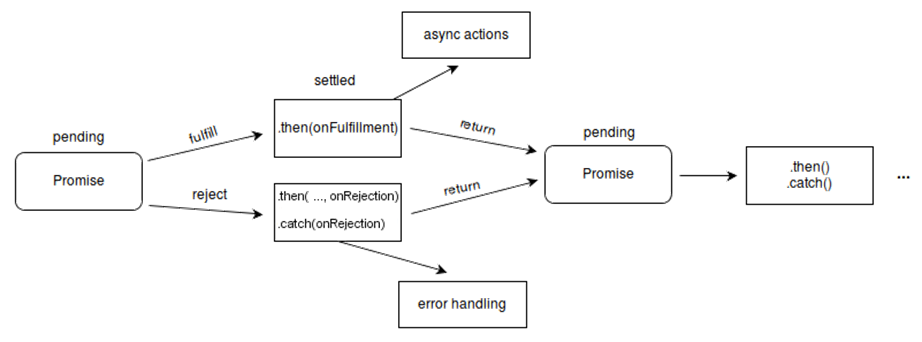

# Essential ES for React

This one pager explains the core concepts of JavaScript and ECMAScript that are necessary for working with React.

## Introduction

### ECMAScript

- Specification / Standard
- How to create a scripting language
- Synonyms: ES6-7-8-9, ES Next ~ ECMAScript 2015, ECMAScript 2016, ECMAScript 2017, ECMAScript 2018

### JavaScript

- Implementation / conforms to ES
- How to use a scripting language
- A dialect\* of ES

> _A dialect derives most of its lexicon and syntax from its parent language but deviates enough to deserve distinction._

## Environments


## Ecosystem


## JavaScript (ES5) Fundamentals


- Data types (strings, numbers, boolean, null, undefined), Statements, Expressions, Literals, Functions)
- Arrays
- Object – collection of properties and values (note: values can point to functions!)

```JavaScript
var emptyObject = {};
var person = {
    firstName: 'Jane',
    lastName: 'Doe',
    age: 27,
    hasPassport: true,
    kidsNames: ['Jackie', 'Joe', 'Julie'],
    pets: {
        numberOfDogs: 2,
        numberOfCats: 1
    },
    sayHello: function(){ console.log('Hello’); }
};
```

### Objects

- Literals
- Retrieving attributes values
- Updating attribute values
- Reference
- Prototype – `Object.prototype`
- Reflection – `typeof` and `Object.hasOwnProperty`
- Enumeration – `for` and `for..in` loops
- Delete (remove attribute from an object)
- Global Object – use an app level object
  - Approach adopted by many JS frameworks

### Functions

- Function object
  - Functions are first-class objects
- Function literals
- Invocation
  - Method Invocation Pattern
  - Function Invocation Pattern
  - Constructor Invocation Pattern
  - Apply Invocation Pattern
- Arguments
- Return
- Exceptions
- Recursion
- Augmenting Types (Object.prototype)
- Closure
- Scope – no block scope in ES5.
- Callbacks
- Module
- Cascading – method chaining!

```JavaScript
// => function object
function message() {
    alert("Greetings Linda!");
}
alert(typeof message); // => function
alert(message instanceof Object); // => true

// => function literals
// Create a variable called add and store a function
// in it that adds two numbers.
var add = function (a, b) {
    return a + b;
};
```

### Prototypal Inheritance

```JavaScript
var myMammal = {
    name : 'Herb the Mammal',
    get_name : function ( ) {
        return this.name;
    },
    says : function ( ) {
        return this.saying || '';
    }
};

var myCat = Object.create(myMammal);
myCat.name = 'Henrietta';
myCat.saying = 'meow';
myCat.purr = function (n) {
    var i, s = '';
    for (i = 0; i < n; i += 1) {
        if (s) {
            s += '-';
        }
        s += 'r';
    }
    return s;
};

myCat.get_name = function ( ) {
    return this.says( ) + ' ' + this.name + ' ' + this.says( );
};
```

### Hoisting

- **Hoisting in JavaScript** – Both variables and functions get hoisted.
- **However, JavaScript only hoists declarations, not initializations.**

```JavaScript
// Function Hoisting
// Calling function before declaration
sayHello(); // Outputs: Hello, I'm hoisted!

function sayHello() {
    alert("Hello, I'm hoisted!");
}

// Variable Hoisting
var i = 1; // Declare and initialize i
alert(i + ", " + j); // Outputs: 1, undefined
var j = 2; // Declare and initialize j

var x = 5; // Declare and initialize x
var y; // Declare y
alert(x + ", " + y); // Outputs: 5, undefined
y = 10; // Initialize y

var a = 3; // Declare and initialize a
b = 6; // Initialize b
alert(a + ", " + b); // Outputs: 3, 6
var b; // Declare b

var u = 4; // Declare and initialize u
alert(u + ", " + v); // Outputs: 4, undefined
var v; // Declare v
v = 8; // Initialize v
```

## `Object.assign`

The `Object.assign()` method is used to copy the values of all enumerable own properties from one or more source objects to a target object. It will return the target object.

```JavaScript
const target = { a: 1, b: 2 };
const source = { b: 4, c: 5 };

const returnedTarget = Object.assign(target, source);

console.log(target);
// expected output: Object { a: 1, b: 4, c: 5 }

console.log(returnedTarget);
// expected output: Object { a: 1, b: 4, c: 5 }
```

## `Object.create`

The `Object.create()` method creates a new object, using an existing object as the prototype of the newly created object.

```JavaScript
const person = {
    isHuman: false,
    printIntroduction: function () {
        console.log(`My name is ${this.name}. Am I human? ${this.isHuman}`);
    }
};

const me = Object.create(person);

me.name = "Srihari"; // "name" is a property set on "me", but not on "person"
me.isHuman = true; // inherited properties can be overwritten

me.printIntroduction();
// expected output: "My name is Srihari. Am I human? true"
```

## `Object.defineProperty`

The static method `Object.defineProperty()` defines a new property directly on an object, or modifies an existing property on an object, and returns the object.

```JavaScript
const object1 = {};

Object.defineProperty(object1, 'property1', {
    value: 42,
    writable: false
});

object1.property1 = 77;
// throws an error in strict mode

console.log(object1.property1);
// expected output: 42
```

## `Function.prototype.apply`

The `apply()` method calls a function with a given `this` value, and arguments provided as an array.

```JavaScript
const numbers = [5, 6, 2, 3, 7];

const max = Math.max.apply(null, numbers);

console.log(max);
// expected output: 7

const min = Math.min.apply(null, numbers);

console.log(min);
// expected output: 2
```

## `Function.prototype.bind`

The `bind()` method creates a new function that, when called, has its `this` keyword set to the provided value, with a given sequence of arguments preceding any provided when the new function is called.

```JavaScript
const module = {
    x: 42,
    getX: function () {
        return this.x;
    }
}

const unboundGetX = module.getX;
console.log(unboundGetX()); // The function gets invoked at the global scope
// expected output: undefined

const boundGetX = unboundGetX.bind(module);
console.log(boundGetX());
// expected output: 42
```

## `Function.prototype.call`

The `call()` method calls a function with a given this value and arguments provided individually.

```JavaScript
function Product(name, price) {
    this.name = name;
    this.price = price;
}

function Food(name, price) {
    Product.call(this, name, price);
    this.category = 'food';
}

console.log(new Food('cheese', 5).name);
// expected output: "cheese"
```

## JS meets ES Specification

### Babel

[](https://babeljs.io/repl)

- A JavaScript transpiler
- Transpilation – source-to-source compilation. ES6+ `->` ES5
- Babel can:
  - Transform syntax
  - Polyfill features that are missing in your target environment (through @babel/polyfill)
  - Source code transformations (codemods)

Being **‘backward compatible’** without leaving out the benefits of **‘enhanced syntax’** and **‘capabilities of ES6’**.

## Data Types

- `number` for numbers of any kind: integer or floating-point, integers are limited by +/- 2^53^.
- `bigint` is for integer numbers of arbitrary length (cryptography and microsecond precision timestamps) e.g.

```JavaScript
// the "n" at the end means it's a BigInt
const bigInt = 1234567890123456789012345678901234567890n;
```

- `string` for strings. A string may have one or more characters, there’s no separate single-character type.
- boolean for `true`/`false`.
- `null` for unknown values – a standalone type that has a single value null.
- `undefined` for unassigned values – a standalone type that has a single value undefined.
- `object` for more complex data structures.
- `symbol` for unique identifiers.

## The `let` Keyword

- Block scoped variables
- Variables with `var` were function scoped
  - Variables get hoisted
- Variables with `let` are block scoped
  - Variables do not get hoisted

```JavaScript
// ES6 syntax
for (let i = 0; i < 5; i++) {
    console.log(i); // 0,1,2,3,4
}
console.log(i); // undefined


// ES5 syntax
for (var i = 0; i < 5; i++) {
    console.log(i); // 0,1,2,3,4
}
console.log(i); // 5
```

## The `const` Keyword

- Makes it possible to define constants
- Read-only and cannot be re-assigned new values
- Block scoped like `let`

```JavaScript
const PI = 3.14;
console.log(PI); // 3.14

PI = 10; // error
```

```JavaScript
// Changing object property value
const PERSON = { name: "Peter", age: 28 };
console.log(PERSON.age); // 28
PERSON.age = 30;
console.log(PERSON.age); // 30

// Changing array element
const COLORS = ["red", "green", "blue"];
console.log(COLORS[0]); // red
COLORS[0] = "yellow";
console.log(COLORS[0]); // yellow
```

## The `for…of` Loop

- Allows us to iterate over arrays or other iterable objects very easily

```JavaScript
// Iterating over array
let letters = ["a", "b", "c", "d", "e", "f"];

for (let letter of letters) {
    console.log(letter); // a,b,c,d,e,f
}

// Iterating over string
let greet = "Hello World!";

for (let character of greet) {
    console.log(character); // H,e,l,l,o, ,W,o,r,l,d,!
}
```

> The `for...of` loop doesn't work with objects because they are not iterable. If you want to iterate over the properties of an object you can use the `for-in` loop.

## Template Literals

- Provide an easy and clean way to create multi-line strings and perform string interpolation.

```JavaScript
// Simple multi-line string
let str = `The quick brown fox
    jumps over the lazy dog.`;

// String with embedded variables and expression
let a = 10;
let b = 20;
let result = `The sum of ${a} and ${b} is ${a + b}.`;
console.log(result); // The sum of 10 and 20 is 30.
```

## Default Values for Function Parameters

- If no arguments are provided to function when it is called these default parameters values will be used

```JavaScript
// ES6
function sayHello(name = 'World') {
    return `Hello ${name}!`;
}

console.log(sayHello()); // Hello World!
console.log(sayHello('Srihari')); // Hello Srihari!

// ES5
// To achieve this in ES5
function sayHello(name) {
    var name = name || 'World';
    return 'Hello ' + name + '!';
}

console.log(sayHello()); // Hello World!
console.log(sayHello('Srihari')); // Hello Srihari!
```

## Arrow Functions

An **arrow function expression** is a syntactically compact alternative to a regular function expression, although without its own bindings to the `this`, `arguments`, `super`, or `new.target` keywords. Arrow function expressions are ill suited as methods, and they cannot be used as constructors.

```JavaScript
var materials = [
    'Hydrogen',
    'Helium',
    'Lithium',
    'Beryllium'
];

console.log(materials.map(material => material.length));
// expected output: Array [8, 6, 7, 9]
```

### Basic Syntax

```JavaScript
(param1, param2, …, paramN) => { statements }
(param1, param2, …, paramN) => expression
// equivalent to: => { return expression; }

// Parentheses are optional when there's only one parameter name:
(singleParam) => { statements }
singleParam => { statements }

// The parameter list for a function with no parameters should be written with a pair of parentheses.
() => { statements }
```

### Advanced Syntax

```JavaScript
// Parenthesize the body of a function to return an object literal expression:
params => ({ foo: bar })

// Rest parameters and default parameters are supported
(param1, param2, ...rest) => { statements }
(param1 = defaultValue1, param2, …, paramN = defaultValueN) => {
    statements
}

// Destructuring within the parameter list is also supported
const f = ([a, b] = [1, 2], { x: c } = { x: a + b }) => a + b + c;
f(); // 6
```

### No separate `‘this’`

```JavaScript
// ES5 (before ES6 days…)
function Person() {
    // The Person() constructor defines `this` as an instance of itself.
    this.age = 0;

    setInterval(function growUp() {
        // In non-strict mode, the growUp() function defines `this`
        // as the global object (because it's where growUp() is executed.),
        // which is different from the `this`
        // defined by the Person() constructor.
        this.age++;
    }, 1000);
}

var p = new Person();
```

A work around…

```JavaScript
function Person() {
    var that = this; //NOTE: this line captures the value of this
    that.age = 0;

    setInterval(function growUp() {
        // The callback refers to the `that` variable of which
        // the value is the expected object.
        that.age++;
    }, 1000);
}
```

**Fixed in ES6!** Using arrow functions `this` properly refers to the `Person` object.

```JavaScript
function Person() {
    this.age = 0;

    setInterval(() => {
        this.age++; // |this| properly refers to the Person object
    }, 1000);
}

var p = new Person();
```

## Classes

- Introduced in ES6 – looks like classes in other OO languages (Java, C#, etc.)
- Inheritance using `extends` keyword
- By convention class names are written in **`TitleCase`**

```JavaScript
class Person {
constructor(name, birthDate, gender) {
        this.name = name;
        this.birthDate = birthDate;
        this.gender = gender;
    }

    // Class method
    getName() {
        return this.name;
    }
}

let sam = new Person('Sam', Date.parse('01 Jan 1970 07:30:20 GMT') ,'M');
```

```JavaScript
// Patient class inherits from the Person class
class Patient extends Person {
    // Child class constructor
    constructor(patientId, name, birthDate, gender) {
        // Call base class constructor
        super(name, birthDate, gender);
        this.patientId = patientId;
    }

    // Child class method
    getPatientId() {
        return this.patientId;
    }
}
```

> **NOTE:** Unlike function declarations, **class declarations are not hoisted**. Class declarations reside in the **temporal dead zone (TDZ)** until the execution reaches the point of class declaration, similar to `let` and `const` declarations. Therefore, you need to declare your class before accessing it, otherwise a `ReferenceError` will occur.

The equivalent ES5 code is below: (Transformation available [@ es6console.com](https://es6console.com/kylkolbg/)
```JavaScript
'use strict';

var _createClass = function() {
  function defineProperties(target, props) {
    for (var i = 0; i < props.length; i++) {
      var descriptor = props[i];
      descriptor.enumerable = descriptor.enumerable || false;
      descriptor.configurable = true;
      if ("value" in descriptor) descriptor.writable = true;
      Object.defineProperty(target, descriptor.key, descriptor);
    }
  }
  return function(Constructor, protoProps, staticProps) {
    if (protoProps) defineProperties(Constructor.prototype, protoProps);
    if (staticProps) defineProperties(Constructor, staticProps);
    return Constructor;
  };
}();

function _possibleConstructorReturn(self, call) {
  if (!self) {
    throw new ReferenceError("this hasn't been initialised - super() hasn't been called");
  }
  return call && (typeof call === "object" || typeof call === "function") ? call : self;
}

function _inherits(subClass, superClass) {
  if (typeof superClass !== "function" && superClass !== null) {
    throw new TypeError("Super expression must either be null or a function, not " + typeof superClass);
  }
  subClass.prototype = Object.create(superClass && superClass.prototype, {
    constructor: {
      value: subClass,
      enumerable: false,
      writable: true,
      configurable: true
    }
  });
  if (superClass) Object.setPrototypeOf ? Object.setPrototypeOf(subClass, superClass) : subClass.__proto__ = superClass;
}

function _classCallCheck(instance, Constructor) {
  if (!(instance instanceof Constructor)) {
    throw new TypeError("Cannot call a class as a function");
  }
}

var Person = function() {
  function Person(name, birthDate, gender) {
    _classCallCheck(this, Person);

    this.name = name;
    this.birthDate = birthDate;
    this.gender = gender;
  }

  // Class method


  _createClass(Person, [{
    key: 'getName',
    value: function getName() {
      return this.name;
    }
  }]);

  return Person;
}();

var sam = new Person('Sam', Date.parse('01 Jan 1970 07:30:20 GMT'), 'M');

// Patient class inherits from the Person class

var Patient = function(_Person) {
  _inherits(Patient, _Person);

  // Child class constructor
  function Patient(patientId, name, birthDate, gender) {
    _classCallCheck(this, Patient);

    var _this = _possibleConstructorReturn(this, (Patient.__proto__ || Object.getPrototypeOf(Patient)).call(this, name, birthDate, gender));
    // Call base class constructor


    _this.patientId = patientId;
    return _this;
  }

  // Child class method


  _createClass(Patient, [{
    key: 'getPatientId',
    value: function getPatientId() {
      return this.patientId;
    }
  }]);

  return Patient;
}(Person);
```

## Modules

- Modules were not natively supported prior to ES6
- File based module – each module is represented by a **`.js`** file.
- Use the `export` or `import` statement in a module to export or import variables, functions, classes or any other entity to/from other modules or files.

```JavaScript
//main.js
let greet = "Hello World!";
const PI = 3.14;

function multiplyNumbers(a, b) {
    return a * b;
}

// Exporting variables and functions
export { greet, PI, multiplyNumbers };

//app.js
import { greet, PI, multiplyNumbers } from './main.js';

alert(greet); // Hello World!
alert(PI); // 3.14
alert(multiplyNumbers(6, 15)); // 90
```

## Rest Parameters

- Allows passing an arbitrary number of parameters to a function
- Prefix parameter name with rest operator (`...`), three dots.
- Rest parameter can only be the last one in the list of parameters
- Only one rest parameter

```JavaScript
function sortNames(...names) {
    return names.sort();
}

alert(sortNames("Sarah", "Harry", "Peter")); // Harry,Peter,Sarah
alert(sortNames("Tony", "Ben", "Rick", "Jos")); // Ben,Jos,Rick,Tony

function myFunction(a, b, ...args) {
    return args;
}

alert(myFunction(1, 2, 3, 4, 5)); // 3,4,5
alert(myFunction(-7, 5, 0, -2, 4.5, 1, 3)); // 0,-2,4.5,1,3
```

> **NOTE:** When the rest parameter is the only parameter in a function, it gets all the arguments passed to the function, otherwise it gets the rest of the arguments that exceeds the number of named parameters.

## Spread Operator

- Also denoted by (`...`), three dots.
- Performs exact opposite function of rest operator
- Spreads out an array and passes values into the function
- Can be used to insert the elements of an array into another array (without using the array methods like `push()`, `unshift()`, `concat()`, etc.

```JavaScript
function addNumbers(a, b, c) {
    return a + b + c;
}

let numbers = [5, 12, 8];

// ES5 way of passing array as an argument of a function
alert(addNumbers.apply(null, numbers)); // 25

// ES6 spread operator
alert(addNumbers(...numbers)); // 25
```

```JavaScript
let pets = ["Cat", "Dog", "Parrot"];
let bugs = ["Ant", "Bee"];

// Creating an array by inserting elements from other arrays
let animals = [...pets, "Tiger", "Wolf", "Zebra", ...bugs];

alert(animals); // Cat,Dog,Parrot,Tiger,Wolf,Zebra,Ant,Bee
```

## Destructuring Assignment

An expression that makes it easy to _extract values from arrays_, or _properties from objects_, _into distinct variables_ by providing a shorter syntax.

### The array destructuring assignment

```JavaScript
// ES5 syntax
var fruits = ["Apple", "Banana"];

var a = fruits[0];
var b = fruits[1];
alert(a); // Apple
alert(b); // Banana
```

```JavaScript
// ES6 syntax
let fruits = ["Apple", "Banana"];

// Array destructuring assignment
let [a, b] = fruits;

alert(a); // Apple
alert(b); // Banana
```

### Array destructuring using Rest Operator

```JavaScript
// ES6 syntax
let fruits = ["Apple", "Banana", "Mango"];

let [a, ...r] = fruits;

alert(a); // Apple
alert(r); // Banana,Mango
alert(Array.isArray(r)); // true
```

### The object destructuring assignment

```JavaScript
// ES5 syntax
var person = {
    name: "Peter",
    age: 28
};

var name = person.name;
var age = person.age;

alert(name); // Peter
alert(age); // 28
```

```JavaScript
// ES6 syntax
let person = {
    name: "Peter",
    age: 28
};

let { name, age } = person; // Object destructuring assignment

alert(name); // Peter
alert(age); // 28
```

## Generators

Generators simplify iterator-authoring using function\* and yield.

```JavaScript
function* idMaker() {
    var index = 0;
    while (true)
        yield index++;
}

var gen = idMaker(); // "Generator { }"

console.log(gen.next().value); // 0
console.log(gen.next().value); // 1
console.log(gen.next().value); // 2
// ...
```

## Promise

- A **Promise** is a **proxy** for a value not necessarily known when the promise is created.
- The Promise object represents the eventual completion (or failure) of an asynchronous operation, and its resulting value.
- A Promise is in one of these states:
  - `pending`: initial state, neither fulfilled nor rejected.
  - `fulfilled`: meaning that the operation completed successfully.
  - `rejected`: meaning that the operation failed.
- Promises can be chained



### General Pattern

```JavaScript
const promise = new Promise((resolve, reject) => {
    /*
    Do something asynchronous which eventually calls either:
       resolve(someValue); // fulfilled
     or
       reject("failure reason"); // rejected
    */
});
```

### Example

```JavaScript
function asyncGet(url) {
    return new Promise((resolve, reject) => {
        const xhr = new XMLHttpRequest();
        xhr.open("GET", url);
        xhr.onload = () => resolve(xhr.responseText);
        xhr.onerror = () => reject(xhr.statusText);
        xhr.send();
    });
}
```

## That is just the tip of the iceberg


Thanks for reading!
**`Srihari Sridharan`**
_`12 May 2020`_
